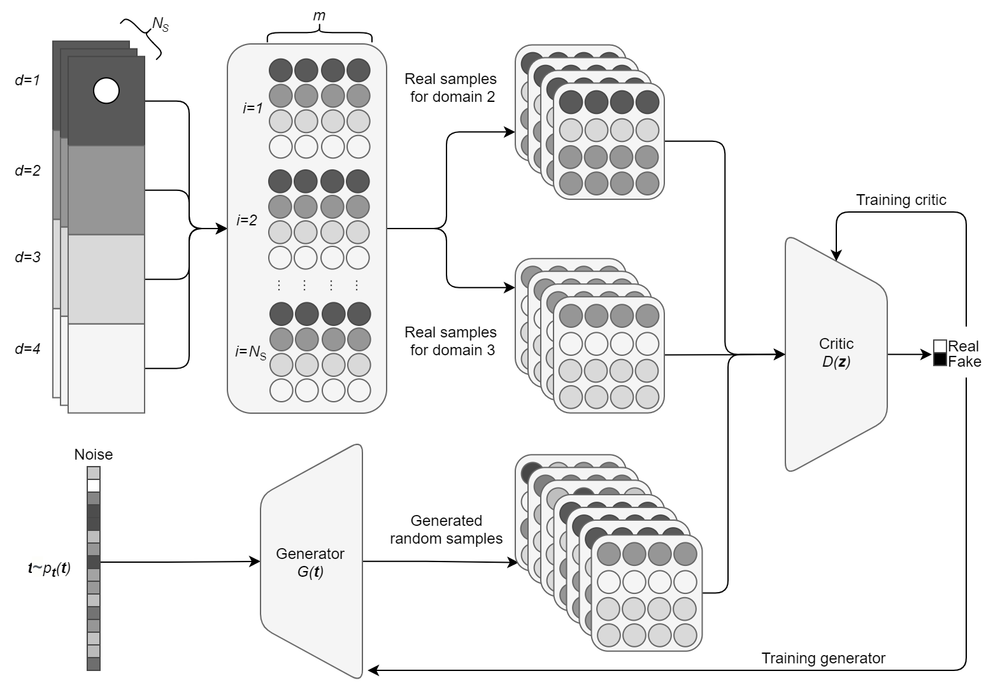

# DD-GAN

## Domain Decomposition Predictive Generative Adversarial Network for modelling fluid flow

[](https://codecov.io/gh/acse-jat20/DD-GAN)
[](https://github.com/acse-jat20/DD-GAN/blob/main/LICENSE)

[](https://github.com/psf/black)
<!-- [](https://github.com/acse-jat20/DD-GAN/blob/main/docs/docs.pdf) -->

<!-- ABOUT THE PROJECT -->


This project contains a library for interacting with a domain decomposition predictive GAN. This draws on ideas from recent research on [domain decomposition methods for reduced order modelling](https://www.sciencedirect.com/science/article/pii/S0045793019300350) and [predictive GANs](https://arxiv.org/abs/2105.07729) to predict fluid flow in time. Validation and examples performed using flow past a cylinder in high aspect ratio domains can be found found here.

---
<!-- PROJECT LOGO -->

<br />
<p align="center">
  <a href="https://github.com/acse-jat20/DD-GAN">
    
  </a>

<p align="center">
    <br />
    <a href="https://github.com/acse-jat20/DD-GAN/blob/main/docs/docs.pdf"><strong>Explore the docs»</strong></a>
    <br />
    <br />
    <a href="https://github.com/acse-jat20/DD-GAN/issues">Report Bug</a>
  </p>
</p>

<!-- TABLE OF CONTENTS -->

<details open="open">
  <summary>Table of Contents</summary>
  <ol>
    <li>
      <a href="#getting-started">Getting Started</a>
      <ul>
        <li><a href="#prerequisites">Prerequisites</a></li>
        <li><a href="#installation">Installation</a></li>
      </ul>
    </li>
    <li>
      <a href="#documentation">Getting Started</a>
      <ul>
        <li><a href="#training">Training</a></li>
        <li><a href="#prediction">Prediction</a></li>
      </ul>
    </li>
    <li><a href="#license">License</a></li>
    <li><a href="#contact">Contact</a></li>
    <li><a href="#acknowledgements">Acknowledgements</a></li>
  </ol>
</details>


<!-- GETTING STARTED -->

## Prerequisites

* Python 3.8
* Tensorflow and other packages in ```requirements.txt```

## Getting Started
### Traversing: Simplified filestructure

    .
    ├── data				# Various data files
    │   ├── FPC_Re3900_2D_CG_old		# .vtu files of FPC
    │   ├── processed			# End-to-end, integration tests (alternatively `e2e`)
    │   │   ├── DD				# Decomposed .npy files
    │   │   ├── Single			# Non-DD .npy files
    │   │   └── old				# Non-DD .npy files from an outdated simulation
    │   └── reconstructed 			# Reconstructed simulation example
    ├── ddgan				# Main method
    │   ├── src
    │   │   ├── Optimize.py			# Class for predicting fluid flow
    │   │   ├── Train.py			# Class for training a GAN
    │   │   └── Utils.py			# Utils for training and predicting
    │   └── tests 				# Unit testing for GAN
    ├── docs				# Documentation files 
    ├── examples                     	
    │   ├── models/224			# Saved model for replication purposes 
    │   └── DD-GAN_usage_example.ipynb	# Usage example notebook
    ├── images
    │   ├── flowcharts			# Flowcharts
    │   ├── paraview			# paraview visualisations
    │   └── plots				# Error plots and simulations
    ├── LICENSE
    ├── README.md
    ├── environment.yml			# Conda env
    ├── requirements.txt
    └── setup.py


### Installation

1. ```git clone https://github.com/acse-jat20/DD-GAN```
2. ```cd ./DD-GAN```
3. ```pip install -e .```

<!-- USAGE EXAMPLES -->

### Usage

In a python file, import the following to use all of the functions:

```python
import ddgan
from ddgan import *
```
If importing the modules does not work, remember to append the path:

```python
import sys
sys.path.append("..")
from ddgan import *
```

### Example data:

* The POD coefficients used in the project can be found under [/data](./data/processed/DD/) *- Original .vtu files curteousy of Dr. Claire Heaney*

### Example scripts:
* An example notebook that demonstrates the data formatting, training and prediction can be found in [/examples](./examples/) 

## Documentation:
This tool includes a workflow split up into two packages. 
 - GAN Training 
 - GAN Prediction

Here a general outline of the possibilities each package offers is mentioned. For a more in depth review please explore the [documentation](https://github.com/acse-jat20/DD-GAN/blob/main/docs/docs.pdf) and the [usage example](https://github.com/acse-jat20/DD-GAN/blob/main/examples/DD-GAN_usage_example.ipynb).

A minimal example of a non-dd version of the code can be found in the following notebook
[](https://colab.research.google.com/drive/1WGM_9iDXso8YyBpaLA-duVycPbzzVtdo?usp=sharing)

### Training:
The GAN initializer accepts a dictionary as an argument as follows:
```python
gan_example = GAN(**kwargs)
```
Here the possible keyword argument include:


```python
# Input data parameters
nsteps: int = 10  # Consecutive timesteps
ndims: int = 10  # Reduced dimensions
batch_size: int = 20  # 32
batches: int = 10  # 900
seed: int = 143  # Random seed for reproducability
epochs: int = 500  # Number of training epochs
nLatent: int = 10  # Dimensionality of the latent space
gen_learning_rate: float = 0.0001  # Generator optimization learning rate
disc_learning_rate: float = 0.0001  # Discriminator optimization learning
logs_location: str = './logs/gradient_tape/'  # Saving location for logs
model_location: str = 'models/'  # Saving location for model

# WGAN training parameters
n_critic: int = 5  # Number of gradient penalty computations per epoch
lmbda: int = 10  # Gradient penalty multiplier

# Data augmentation
noise: bool = False  # If input generator_input is added during training
noise_level: float = 0.001  # Standard deviation of a normal distribution with mu = 0
n_gradient_ascent: int = 500  # The periodicity of making the discriminator taking a step back
```

The GAN is then trained by calling a setup and train function as follows:

```python
gan.setup()
# If the GAN is to be trained
gan.learn_hypersurface_from_POD_coeffs(training_data)
```


### Prediction:
The prediction workflow accepts a dictionary as an argument as follows:

```python
optimizer = Optimize(**kwargs_opt)
```

Here the kwargs include

```python
# Input data hyperparameters
start_from: int = 100  # Initial timestep
nPOD: int = 10  # Number of POD coefficients
nLatent: int = 10  # Dimensionality of latent space
dt: int = 1  # Delta i in the thesis, step size

# Optimization hyperparameters
npredictions: int = 20  # Number of future steps
optimizer_epochs: int = 5000  # Number of optimizer epochs

# Only for DD
evaluated_subdomains: int = 2  # Number of non-boundrary subdomains
cycles: int = 3  # Number of times the domains are traversed
dim_steps = None  # n in the paper. = [n_b, n_a, n_self]

debug: bool = False  # Debug mode
initial_values: str = "Past"  # Initial guess for future timestep. Zeros, Past or None

disturb: bool = False  # Nudge the optimization from local minima regularly
```

Then the prediction can be made by calling predict or predictDD

```python
optimizer.predict(training_data)
```
OR
```python
optimizer.predictDD(training_data,
	                boundrary_conditions,
                    dim_steps=added_dims)
```

<!-- ACKNOWLEDGEMENTS 
_For more information, please refer to the report in this repo_
-->
<!-- LICENSE -->

## License

Distributed under the MIT License. See `LICENSE` for more information.

<!-- CONTACT -->


## Contact

* Tómasson, Jón Atli jon.tomasson1@gmail.com

<!-- ACKNOWLEDGEMENTS -->

## Acknowledgements

* Dr. Claire Heaney
* Prof. Christopher Pain
* Zef Wolffs

<!-- MARKDOWN LINKS & IMAGES -->

<!-- https://www.markdownguide.org/basic-syntax/#reference-style-links 
[contributors-shield]: https://img.shields.io/github/contributors/acse-2020/group-project-the-uploaders.svg?style=for-the-badge
[contributors-url]: https://github.com/acse-2020/acse-4-x-ray-classification-losslandscape/graphs/contributors
[issues-shield]: https://img.shields.io/github/issues/acse-2020/group-project-the-uploaders.svg?style=for-the-badge
[issues-url]: https://github.com/acse-2020/acse-4-x-ray-classification-losslandscape/issues
[license-shield]: https://img.shields.io/github/license/acse-2020/group-project-the-uploaders.svg?style=for-the-badge
[license-url]: https://github.com/acse-2020/acse-4-x-ray-classification-losslandscape/blob/main/LICENSE.txt
-->
