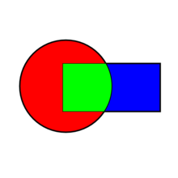

# DD-GAN

## Domain Decomposition Predictive Generative Adversarial Network

[](https://codecov.io/gh/acse-jat20/DD-GAN)

<!-- PROJECT LOGO -->

<br />
<p align="center">
  <a href="https://github.com/acse-jat20/DD-GAN">
    
  </a>

<p align="center">
    <br />
    <a href="https://github.com/acse-jat20/DD-GAN/docs"><strong>Explore the docs»</strong></a>
    <br />
    <br />
    <a href="https://github.com/acse-jat20/DD-GAN/issues">Report Bug</a>
  </p>
</p>

<!-- TABLE OF CONTENTS -->

<details open="open">
  <summary>Table of Contents</summary>
  <ol>
    <li>
      <a href="#about-the-project">About The Project</a>
    </li>
    <li>
      <a href="#getting-started">Getting Started</a>
      <ul>
        <li><a href="#prerequisites">Prerequisites</a></li>
        <li><a href="#installation">Installation</a></li>
      </ul>
    </li>
    <li><a href="#usage">Usage</a></li>
    <li><a href="#license">License</a></li>
    <li><a href="#contact">Contact</a></li>
    <li><a href="#acknowledgements">Acknowledgements</a></li>
  </ol>
</details>

<!-- ABOUT THE PROJECT -->

## About The Project

The LossLandscape research group presents to you a classifier that identifies chest x-ray images of healthy patients, patients that have lung-opacity, pneumonia or covid-19 using machine learning. 

Features:

* Ensemble method that makes composite model out of three machine learning networks
* Wide range of possible models to implement(ResNet, GoogLeNet, SqueezeNet etc.)
* Accurate results.
* Elegant visualization showing functionality using wandb.ai.
* Stable and continuous software maintenance using Github Actions. 

<!-- GETTING STARTED -->

## Prerequisites

* Python 3.8
* Tensorflow and other packages in ```requirements.txt```

## Getting Started

```sh
git clone https://github.com/acse-jat20/DD-GAN
```

## Installation

1. ```git clone https://github.com/acse-jat20/DD-GAN```
2. ```cd ./DD-GAN```
3. ```pip install -e .```

<!-- USAGE EXAMPLES -->

## Usage

In a python file, import the following to use all of the functions:

```python
import ddgan
```

<!-- ACKNOWLEDGEMENTS 
_For more information, please refer to the report in this repo_
-->
<!-- LICENSE -->

## License

Distributed under the MIT License. See `LICENSE` for more information.

<!-- CONTACT -->


## Contact

* Tómasson, Jón Atli jon.tomasson20@imperial.ac.uk
* Wolffs, Zef zef.wolffs20@imperial.ac.uk

<!-- ACKNOWLEDGEMENTS -->

## Acknowledgements

* Dr. Claire Heaney
* Prof. Christopher Pain
* Royal School of Mines, Imperial College London

<!-- MARKDOWN LINKS & IMAGES -->

<!-- https://www.markdownguide.org/basic-syntax/#reference-style-links 
[contributors-shield]: https://img.shields.io/github/contributors/acse-2020/group-project-the-uploaders.svg?style=for-the-badge
[contributors-url]: https://github.com/acse-2020/acse-4-x-ray-classification-losslandscape/graphs/contributors
[issues-shield]: https://img.shields.io/github/issues/acse-2020/group-project-the-uploaders.svg?style=for-the-badge
[issues-url]: https://github.com/acse-2020/acse-4-x-ray-classification-losslandscape/issues
[license-shield]: https://img.shields.io/github/license/acse-2020/group-project-the-uploaders.svg?style=for-the-badge
[license-url]: https://github.com/acse-2020/acse-4-x-ray-classification-losslandscape/blob/main/LICENSE.txt
-->
